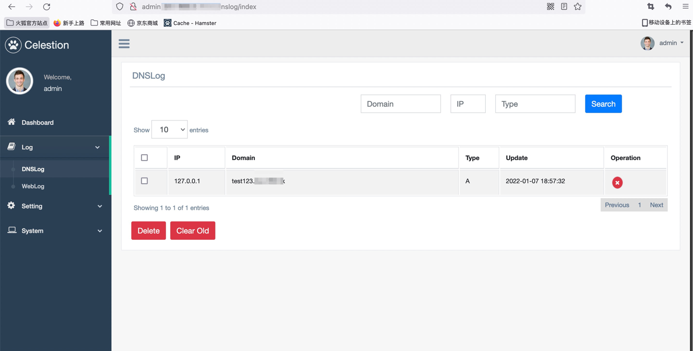
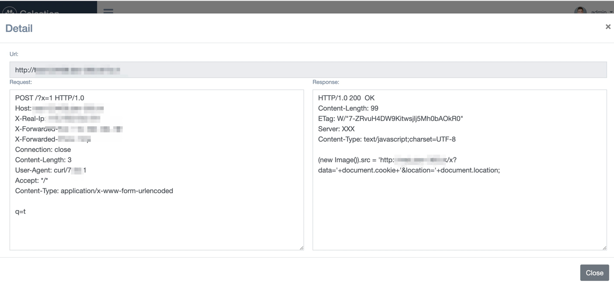
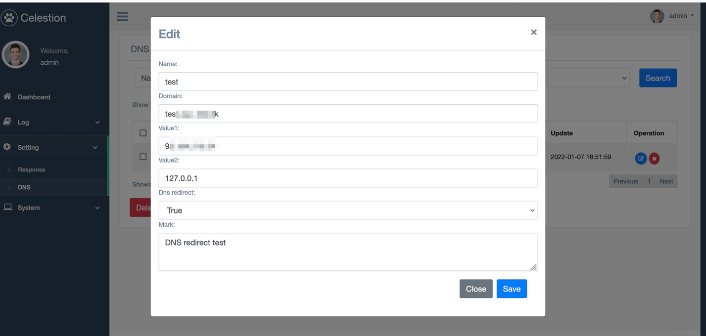
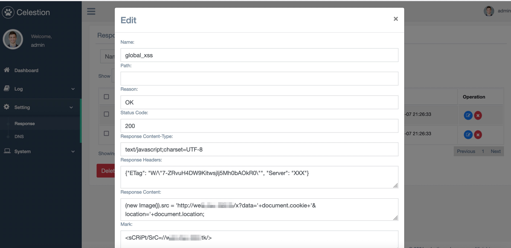

# 概述

Celestion 是一个无回显漏洞测试辅助平台，平台使用flask编写，提供DNSLOG，HTTPLOG等功能。 (界面懒得弄，后续有需要再说)。

[](https://www.python.org/)

1. 提供DNSLOG
2. 提供HTTPLOG(完整request数据包)
3. 自定义HTTP返回包(status_code, headers, body)
4. 自定义DNS解析(A记录)
5. DNS Rebinding
6. 支持钉钉机器人
7. 支持API查询


# 安装

1. 申请A.com, B.com 2个域名，并配置NS、A记录，参考[BugScanTeam/DNSLog](https://github.com/BugScanTeam/DNSLog) 的域名配置部分#安装-3

2. 修改 `lib/core/config`，配置内容请看注释。

3. 运行初始化

```
python3.9 -m venv venv
source venv/bin/activate
pip install -r requirements.txt
python init.py
```

3. 运行

```
source venv/bin/activate
python celestion.py
```

# 模块

## 展示





## 自定义DNS-A记录



## 自定义HTTP返回包



## API接口

接口格式：

```python
import requests
url = "http://{ADMIN_DOMAIN}/{path}"
headers = {
    "API-Key": "你的API-Key", 
    "Content-Type": "application/json",
}
data = {}
response = requests.request("POST", url, headers=headers, json=data)
print(response.json())
```

API-Key 在 `http://{ADMIN_DOMAIN}/reset` 页面可以看到。

1. `/api/weblog/list`

```python
data = {
    "page": 1,
    "per_page": 10,
    "ip": "",
    "url": "",
}
```

2. `/api/weblog/detail`

```python
data = {
    "id": 1,
}
```

3. `/api/dnslog/list`

```python
data = {
    "domain": "",
    "ip": "",
}
```

# 参考 

1. [BugScanTeam/DNSLog](https://github.com/BugScanTeam/DNSLog)
